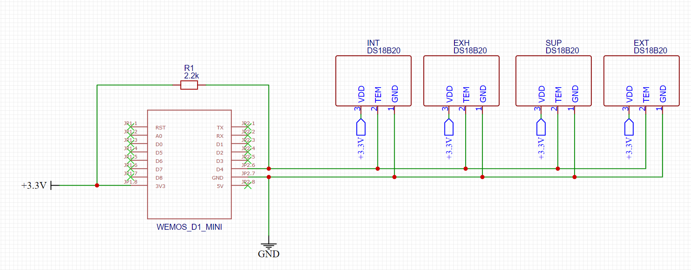
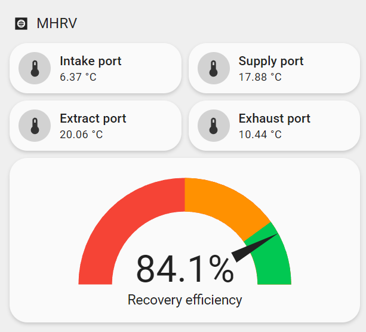

This is a simple project that allows monitoring a MHRV (Mechanical Heat Recovery Ventilation) system temperatures and recovery efficiency. It's been tested with a VentAxia Sentinel Kinetic B, but should work with any MHRV system, provided there's enough space around the intake / exhaust / extract and supply ports to fit the temperature probes.

